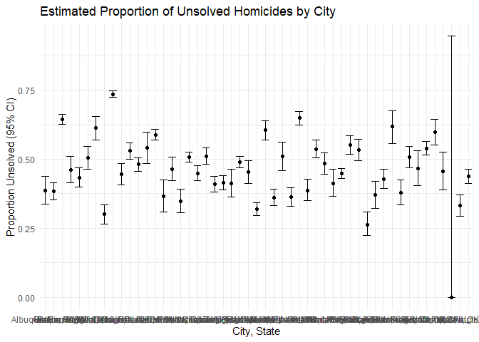

hw5_prob3
================

``` r
library(tidyverse)
```

## Problem 3

``` r
homicide_raw = read_csv("data_hw5/homicide-data.csv")
```

    ## Rows: 52179 Columns: 12
    ## ── Column specification ────────────────────────────────────────────────────────
    ## Delimiter: ","
    ## chr (9): uid, victim_last, victim_first, victim_race, victim_age, victim_sex...
    ## dbl (3): reported_date, lat, lon
    ## 
    ## ℹ Use `spec()` to retrieve the full column specification for this data.
    ## ℹ Specify the column types or set `show_col_types = FALSE` to quiet this message.

``` r
summary(homicide_raw)
```

    ##      uid            reported_date       victim_last        victim_first      
    ##  Length:52179       Min.   : 20070101   Length:52179       Length:52179      
    ##  Class :character   1st Qu.: 20100318   Class :character   Class :character  
    ##  Mode  :character   Median : 20121216   Mode  :character   Mode  :character  
    ##                     Mean   : 20130899                                        
    ##                     3rd Qu.: 20150911                                        
    ##                     Max.   :201511105                                        
    ##                                                                              
    ##  victim_race         victim_age         victim_sex            city          
    ##  Length:52179       Length:52179       Length:52179       Length:52179      
    ##  Class :character   Class :character   Class :character   Class :character  
    ##  Mode  :character   Mode  :character   Mode  :character   Mode  :character  
    ##                                                                             
    ##                                                                             
    ##                                                                             
    ##                                                                             
    ##     state                lat             lon          disposition       
    ##  Length:52179       Min.   :25.73   Min.   :-122.51   Length:52179      
    ##  Class :character   1st Qu.:33.77   1st Qu.: -96.00   Class :character  
    ##  Mode  :character   Median :38.52   Median : -87.71   Mode  :character  
    ##                     Mean   :37.03   Mean   : -91.47                     
    ##                     3rd Qu.:40.03   3rd Qu.: -81.76                     
    ##                     Max.   :45.05   Max.   : -71.01                     
    ##                     NA's   :60      NA's   :60

Comments on the raw data:  
The raw data contains 12 columns and 52,179 entries. Column variables
are uid, reported_data, victim_last (all caped), victim_first (all
caped), victim_race, victim_age, victim_sex, city, state, lat, lon, and
disposition.

Create a `city_state` variable.

``` r
homicide_df = 
  homicide_raw |>
  mutate(
    city_state = paste(city, state, sep = ", ")
  )
```

Summarize within cities to obtain the total number of homicides and the
number of unsolved homicides (those for which the disposition is “Closed
without arrest” or “Open/No arrest”).

``` r
homicide_summary  = 
  homicide_df |> 
  group_by(city_state) |> 
  summarise(
    total = n(),
    unsolved = sum(disposition %in% c("Closed without arrest","Open/No arrest"))
  )
```

For the city of Baltimore, MD, use the `prop.test` function to estimate
the proportion of homicides that are unsolved; save the output of
prop.test as an R object, apply the broom::tidy to this object and pull
the estimated proportion and confidence intervals from the resulting
tidy dataframe.

``` r
baltimore_summary = 
  homicide_df |> 
  filter(city_state == "Baltimore, MD") |> 
  summarise(
    total = n(),
    unsolved = sum(disposition %in% c("Closed without arrest","Open/No arrest"))
  )
```

``` r
baltimore_prop = 
  prop.test(
    x = baltimore_summary$unsolved,
    n = baltimore_summary$total
  )
baltimore_prop_tidy  = 
  broom::tidy(baltimore_prop) |> 
  select(estimate, conf.low, conf.high)
baltimore_prop_tidy
```

    ## # A tibble: 1 × 3
    ##   estimate conf.low conf.high
    ##      <dbl>    <dbl>     <dbl>
    ## 1    0.646    0.628     0.663

run prop.test on each cities in the dataset.

``` r
homicide_results=
  homicide_summary |> 
  mutate(
    prop_test = map2(
      unsolved, total, ~ prop.test(x= .x, n= .y)
    ),
    tidy_result = map(prop_test, broom::tidy)
  ) |> 
  unnest(tidy_result) |> 
  select(city_state, estimate, conf.low, conf.high)
```

    ## Warning: There was 1 warning in `mutate()`.
    ## ℹ In argument: `prop_test = map2(unsolved, total, ~prop.test(x = .x, n = .y))`.
    ## Caused by warning in `prop.test()`:
    ## ! Chi-squared approximation may be incorrect

``` r
homicide_results
```

    ## # A tibble: 51 × 4
    ##    city_state      estimate conf.low conf.high
    ##    <chr>              <dbl>    <dbl>     <dbl>
    ##  1 Albuquerque, NM    0.386    0.337     0.438
    ##  2 Atlanta, GA        0.383    0.353     0.415
    ##  3 Baltimore, MD      0.646    0.628     0.663
    ##  4 Baton Rouge, LA    0.462    0.414     0.511
    ##  5 Birmingham, AL     0.434    0.399     0.469
    ##  6 Boston, MA         0.505    0.465     0.545
    ##  7 Buffalo, NY        0.612    0.569     0.654
    ##  8 Charlotte, NC      0.300    0.266     0.336
    ##  9 Chicago, IL        0.736    0.724     0.747
    ## 10 Cincinnati, OH     0.445    0.408     0.483
    ## # ℹ 41 more rows

Create a plot that shows the estimates and CIs for each city.

``` r
homicide_results = 
 homicide_results |> 
  arrange(estimate)

homicide_plot = 
  ggplot(homicide_results, 
         aes(x = city_state, 
             y = estimate))+
  geom_point()+
  geom_errorbar(aes(ymin = conf.low, ymax = conf.high))+
  labs(
    title = "Estimated Proportion of Unsolved Homicides by City",
    x = "City, State",
    y = "Proportion Unsolved (95% CI)"
  ) +
  theme_minimal()

homicide_plot
```

<!-- -->
