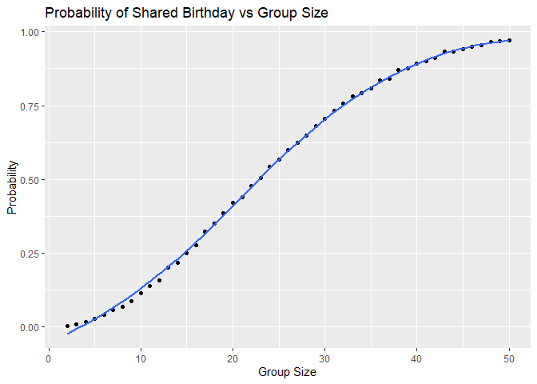
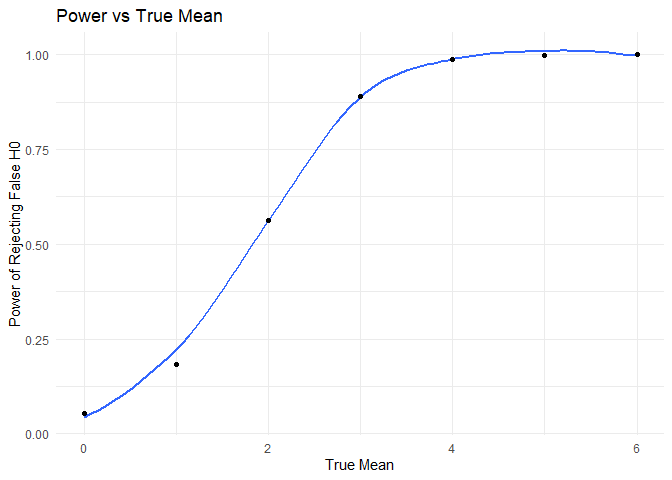
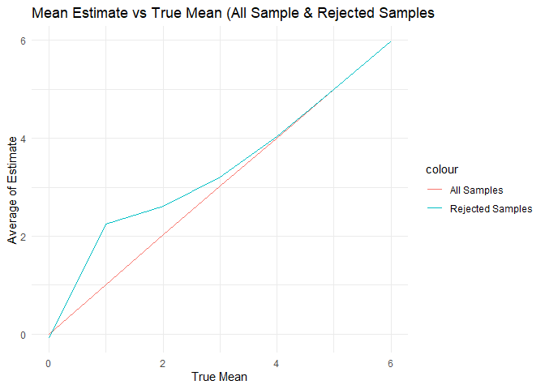

p8105_hw5_yx3033
================

``` r
library(tidyverse)
library(rvest)
```

## Problem 1

``` r
birthday = function(n){
  birthdays = sample(1:365, size = n, replace = TRUE)
  any(duplicated(birthdays))
}
```

``` r
sim_groupsize_df = 
  expand_grid(
    group_size = 2:50,
    iter = 1:10000
  )
```

``` r
sim_groupsize_df  = 
  sim_groupsize_df |> 
  mutate(
    matched = map_lgl(group_size, birthday)
  )
```

``` r
#summarize probabilities

prob_df = 
  sim_groupsize_df |> 
  group_by(group_size) |> 
  summarise(probability = mean(matched))
```

``` r
ggplot(prob_df,
       aes(x = group_size, y = probability)
) +
  geom_point()+
  geom_smooth(se = FALSE)+
  labs(
    title = "Probability of Shared Birthday vs Group Size",
    x = "Group Size",
    y = "Probability"
  )
```

    ## `geom_smooth()` using method = 'loess' and formula = 'y ~ x'

<!-- -->

The probability of two people share a birthday starts from 0 and
increases nonlinearly with group size. It reaches 50% when there are
around 23 people. As the group size goes beyond 40, the probability
grows start to slow down as the line gets flatter.

## Problem 2

``` r
onet_sim = function(mu, n=30, sigma = 5){
  x = rnorm(n, mean = mu, sd = sigma)
  
  test = t.test(x, mu = 0)
  
  tidy_test = broom::tidy(test)
  
  tibble(
    mu_hat = tidy_test$estimate,
    p_value = tidy_test$p.value
  )
}
```

``` r
onet_sim_df = expand_grid(
  mu_true = 0:6,
  iter = 1:5000
) |> 
  mutate(
    onet_results = map(mu_true, onet_sim)
  ) |> 
  unnest(onet_results)
```

``` r
onet_summary = 
  onet_sim_df |> 
  group_by(mu_true) |> 
  summarize(
    power = mean(p_value<0.05),
    mean_mu_hat_all = mean(mu_hat),
    mean_mu_hat_rejected = mean(mu_hat[p_value<0.05])
  )
```

``` r
ggplot(onet_summary,
       aes(y=power, x=mu_true))+
  geom_smooth(se = FALSE)+
  geom_point()+
  labs(
    title = "Power vs True Mean",
    x = "True Mean",
    y = "Power of Rejecting False H0"
  )+
  theme_minimal()
```

    ## `geom_smooth()` using method = 'loess' and formula = 'y ~ x'

<!-- -->

The plot shows that the power increases with effect size. As the true
mean increases, it becomes eaiser to detect

``` r
ggplot(onet_summary,
       aes(x = mu_true))+
  geom_line(aes(y=mean_mu_hat_all, color = "All Samples"))+
  geom_line(aes(y= mean_mu_hat_rejected, color="Rejected Samples"))+
  labs(
    title = "Mean Estimate vs True Mean (All Sample & Rejected Samples",
    x = "True Mean",
    y = "Average of Estimate"
  )+
  theme_minimal()
```

<!-- -->

The average of mean across all samples are similar to the true mean. But
the average mean among only rejected samples (significant samples) is
biased upward because significant results tend to have larger observed
value. This is a form of selection bias.
